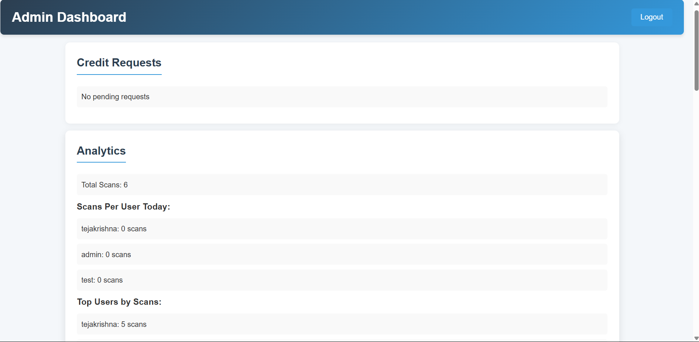
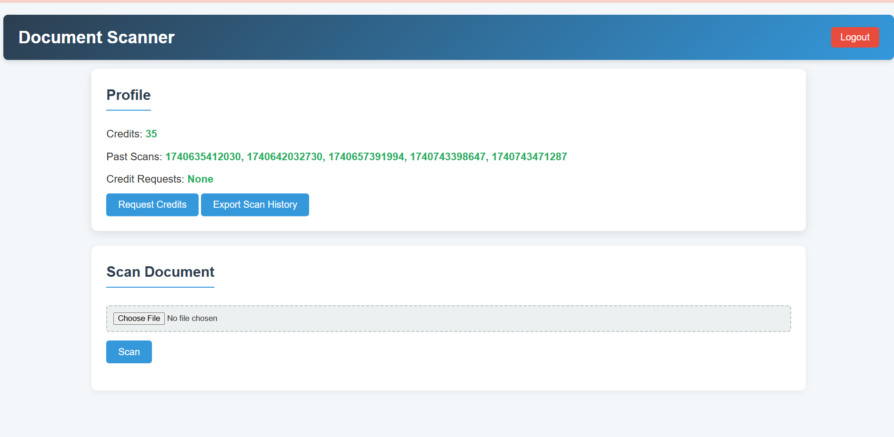
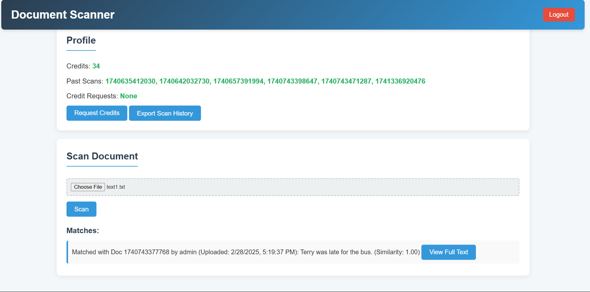
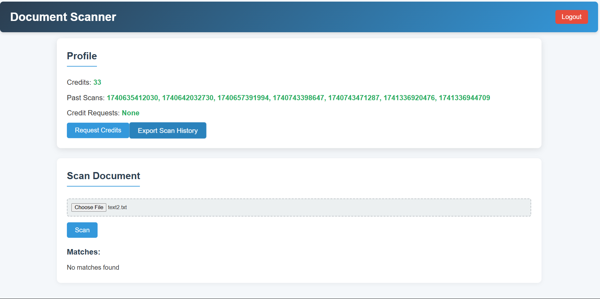

# Document-scanner

To access the files  

```
username : admin
password : admin123
```


Place everything in a `document-scanner` folder, follow the `README.md` setup, and you’re ready to run the system:
```bash
npm install
npm start
```

THIS REFERS TO ADMIN PAGE 



This is user page 



Comparing the text.



Comparing the text.


